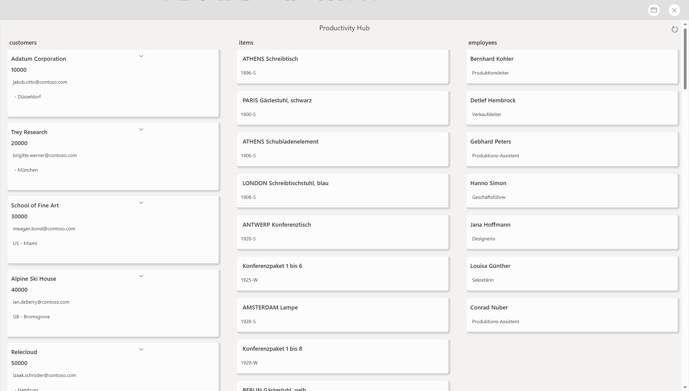
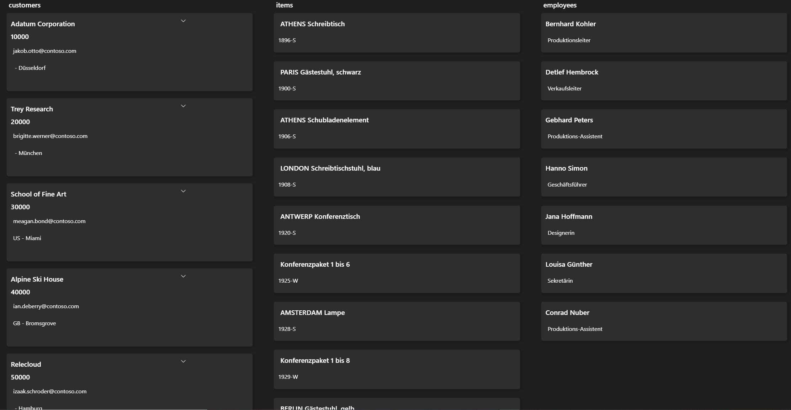

# ProductivityHub4BC

Productivity Hub for Business Central is a Power Apps solution that allows users to view and interact with a dashboard containing information on Business Central tables customers, items, and employees. 

## Architecture

The solution consists of

* a Power Apps canvas app

## Features

### App Level

Productivity Hub

* is fully responsive and looks good on any screen size and orientation
* can be used as a standalone app or as a personal app in Microsoft Teams
* adjusts to all 3 themes in Teams: default, dark, high-contrast

## Canvas App Design

* app leverages a [custom theme](https://github.com/pnp/powerapps-samples/tree/main/samples/fluentui-for-teams-theme) - built to adapt Microsoft Teams look & feel
* makes extensive use of containers to achieve responsive behavior

## Resources

* [Build a Power Apps component](https://learn.microsoft.com/training/modules/build-power-app-component/)
* [Dynamics 365 Business Central connector for Power Plaform](https://learn.microsoft.com/connectors/dynamicssmbsaas/)
